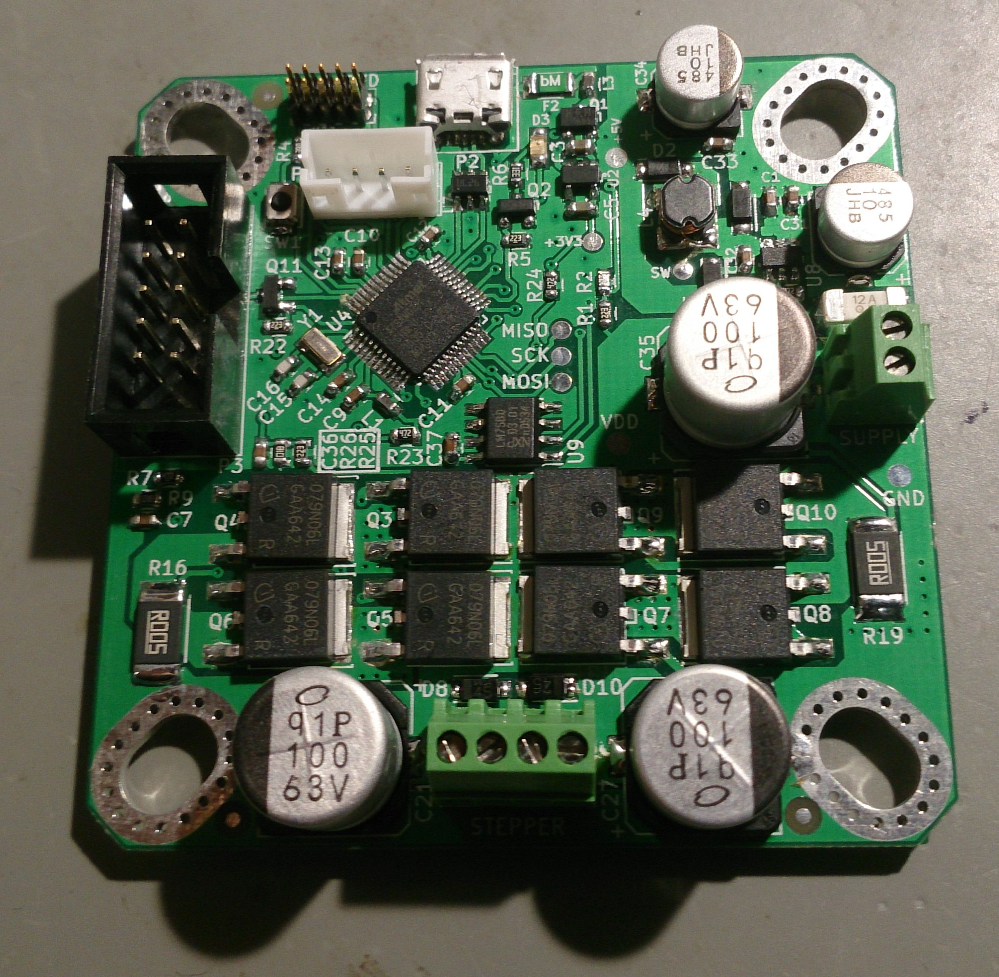
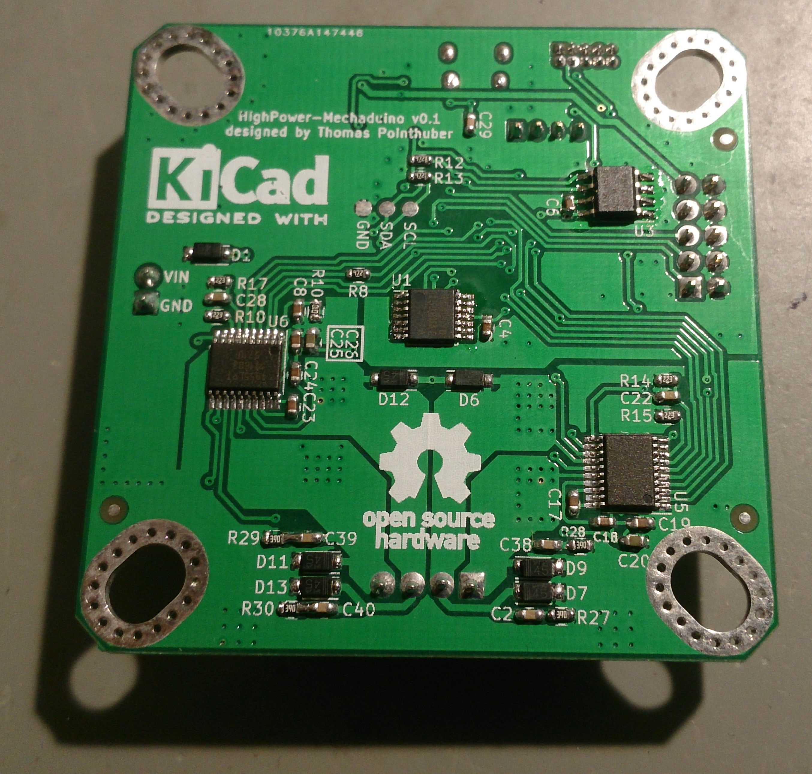

## PCB Assembly of first Prototype (v0.1) (18.03.2017)

### Assembly Order

1. Driver Mosfets, using a heating plate
2. Driver IC
3. SAMD21 ARM CPU
3. Chip SMD Capacitors
4. Chip SMD Resistors
5. Diodes
6. Fuses
7. Inductors
8. Remainig MosFET
9. Some IC's on the top side (regulator, temp-sensor)
10. Crystal
11. Switch
12. USB and SWD connector
13. Electrolyth Capacitors
14. Remaining Connectors
15. U1 and U3

required time for soldering: 4:30h

Top                                                             | Bottom
:--------------------------------------------------------------:|:-------------------------------------------------------------------:
  | 


### Problems found while Assembly

* R10 and R18 looks quite similar on pcb (via below silkscreen)
* A bit more thermal spaces to the pad's would be useful
* switch is note easy to reach


## First tests of the prototype

### Step Down measurements

The only connection to the board was the Supply voltage connected to the SUPPLY connector.

V_in    | I_in      | TP 5V     | TP 3.3V
--------|-----------|-----------|--------
4.3V    | 2.1mA     | 4.0V      | 3.33V
5.0V    | 2.3mA     | 4.5V      | 3.33V
6.0V    | 2.2mA     | 4.5V      | 3.33V
7.0V    | 2.2mA     | 4.5V      | 3.33V
10.0V   | 1.9mA     | 4.6V      | 3.33V
12.0V   | 2.0mA     | 4.6V      | 3.33V
15.0V   | 2.2mA     | 4.6V      | 3.33V
20.0V   | 2.4mA     | 4.6V      | 3.33V
25.0V   | 2.6mA     | 4.6V      | 3.33V
30.0V   | 2.8mA     | 4.6V      | 3.33V
35.0V   | 3.1mA     | 4.6V      | 3.33V
40.0V   | 3.5mA     | 4.6V      | 3.33V
45.0V   | 3.8mA     | 4.6V      | 3.33V
48.0V   | 4.0mA     | 4.6V      | 3.33V
50.0V   | 4.2mA     | 4.6V      | 3.33V

For now, all seems OK. Please note, The 5V Test Point does not actually reach 5V. According to my calculations,
a voltage between 4.47-4.62V is expected. This is due some design decisions, which result in lower part requirements.

Expected Voltage at TP 3.3V lies between 3.25-3.35, which Is also looks OK.

Note to myself: Also measure the voltage at A_IN

### Programming of Arduino Bootloader (25.03.2017)

I'm using an ```ARM-USB-OCD-H``` connected to board usin the ```ARM-JTAG-SWD``` adapter.
Furthermore, I connected the usb port to my computer, to power up the device.

Content of ```openocd_olimex.cfg```:

```
source [find interface/ftdi/olimex-arm-usb-ocd-h.cfg]
source [find interface/ftdi/olimex-arm-jtag-swd.cfg]

set CHIPNAME at91samd21g18
set ENDIAN little

source [find target/at91samdXX.cfg]
```

#### upload bootloader using openocd

```
$ openocd -f openocd_olimex.cfg
```

Note: ``$HOME`` has to be replaced by actual path. Depending on library version, the path to the bootloader probably
also needs to be adjusted.

```
$ telnet 127.0.0.1 4444
> init
> halt
> at91samd bootloader 0
> program {{$HOME/.arduino15/packages/arduino/hardware/samd/1.6.12/bootloaders/zero/samd21_sam_ba.bin}} verify reset
> shutdown
```

When programming finished sucessfully, the LED (D3) should start slowly blinking, indicating that the bootloader is running.


### Upload first example using Arduino IDE

* Select ```Arduino/Genuino Zero (Native USB Port)``` as Boad
* Load the Blink Example
* Select Port which is opened by bootloaders
* press upload and wait until console finished

Now the status LED (D3) should blinking as expected

### Test Board Peripherie

I build a little programm which run's the stepper motor in half step mode.

To specify a maximum current for the motor driver, it was required to rewrite ```analogWrite(uint32_t pin, uint32_t value)```
to use a prescaler of 1/4 instead of 1/256, otherwise the analog output voltage wouldn't be very stable.

After some coding, this is now working, and was able to run a stepper motor with about 120 RPM and active overcurrent protection
using this driver pcb, showing that the general electronic is working as expected.

As next step, I will test the other circuit parts like the analog inputs as well as the SPI Magnetic Rotary Position Sensor,
I2C temperatur sensor and the I2C EEPROM.

### Problems found while Testing

* Pin 2 <-> Pin 4 are swapped on the schematic (they are also swapped in the original arduino schematic, and I didn't spot that)
* The SLEEPn description in the datasheet actually represents physical voltage, which means we need to manually wire
it to 5V to activate the controller
